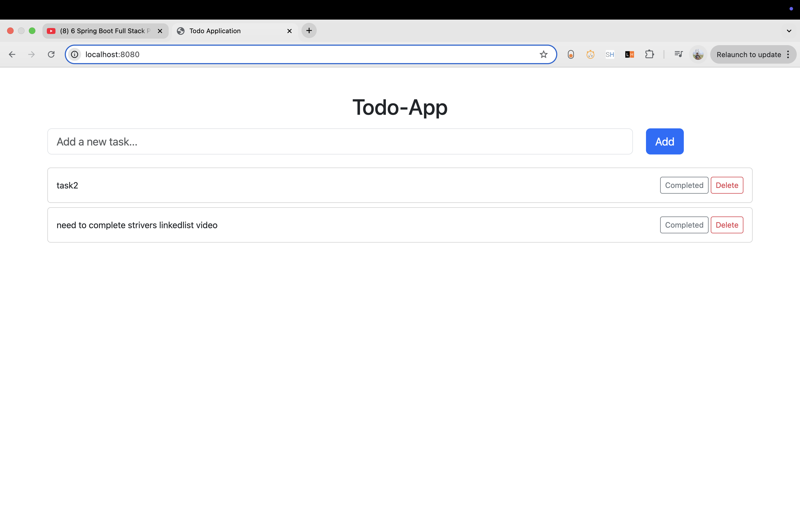

# 📝 Spring Boot Todo Application

A simple Todo application built with Spring Boot and Thymeleaf. This project demonstrates basic CRUD functionality using Spring MVC and MySQL database.

---

## 🚀 Tech Stack

**Backend:**
- Java
- Spring Boot
- Spring MVC
- Spring Data JPA

**Frontend:**
- HTML
- Thymeleaf
- Bootstrap 5

**Database:**
- MySQL

**Build Tool:**
- Maven

---

## 📌 Key Spring Annotations to Remember

| Annotation         | Description |
|--------------------|-------------|
| `@SpringBootApplication` | Entry point for Spring Boot applications. Combines `@Configuration`, `@EnableAutoConfiguration`, and `@ComponentScan`. |
| `@RestController` or `@Controller` | Declares a controller. Use `@RestController` for REST APIs and `@Controller` for serving views. |
| `@RequestMapping` / `@GetMapping` / `@PostMapping` / `@PutMapping` / `@DeleteMapping` | Maps HTTP methods to handler methods. |
| `@PathVariable` | Binds URI template variables to method parameters. |
| `@RequestParam` | Extracts query parameters from the request URL. |
| `@Entity` | Marks a class as a JPA entity. |
| `@Id` | Specifies the primary key of an entity. |
| `@GeneratedValue` | Configures automatic primary key generation. |
| `@Column` | Maps fields to table columns. |
| `@Repository` | Indicates the class is a data repository. |
| `@Service` | Marks a class as a service layer component. |
| `@Autowired` | Automatically injects dependencies. |

---

## 🛠️ How to Run

1. Clone the repository:
   ```bash
   git clone https://github.com/ckolli66/SpringBoot_TodoApplication.git
2. Navigate to the project directory:
   ```bash
   cd SpringBoot_TodoApplication
3. Run the application:
   ```bash
   mvn spring-boot:run
4. Open your browser and visit:
   ```bash
   http://localhost:8080

---

## 📸 Screenshots



